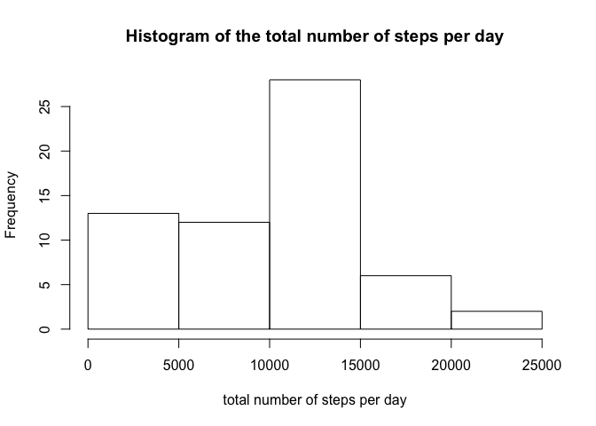
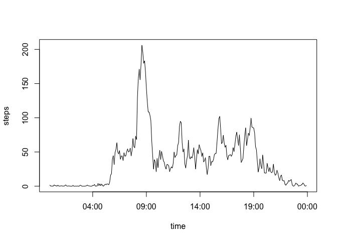
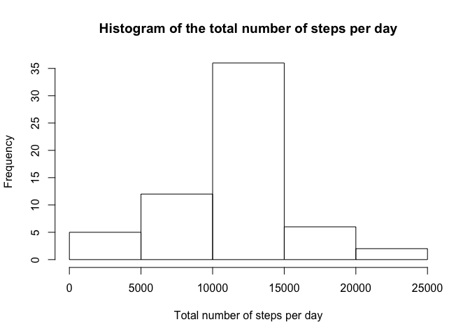
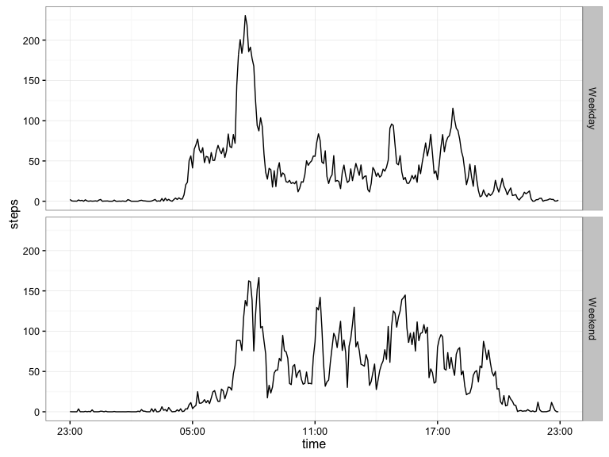

# Reproducible Research: Peer Assessment 1
`r format(Sys.time(), '%d %B, %Y')`  


## Loading and preprocessing the data
This assignment makes use of data from a personal activity monitoring device. This device collects data at 5 minute intervals through out the day. The data consists of **two months** of data from an anonymous individual collected during the months of October and November, 2012 and include the number of steps taken in 5 minute intervals each day.
> The variables included in this dataset are:

> - steps: Number of steps taking in a 5-minute interval (missing values are coded as `NA`)
> - date: The date on which the measurement was taken in YYYY-MM-DD format
> - interval: Identifier for the 5-minute interval in which measurement was taken

Firstly, we load the data and change the variable `date` as date format.

```r
library(dplyr)
activity <- read.csv("../activity.csv", stringsAsFactors = F)
activity$date <- as.Date(activity$date,"%Y-%m-%d")
str(activity)
```

```
## 'data.frame':	17568 obs. of  3 variables:
##  $ steps   : int  NA NA NA NA NA NA NA NA NA NA ...
##  $ date    : Date, format: "2012-10-01" "2012-10-01" ...
##  $ interval: int  0 5 10 15 20 25 30 35 40 45 ...
```

## What is mean total number of steps taken per day?

### Calculate the total number of steps taken per day

```r
by_date <- group_by(activity,date)
step_date <- summarise(by_date, sum(steps, na.rm = T))
names(step_date)[2] <- "steps"
head(step_date)
```

```
## Source: local data frame [6 x 2]
## 
##         date steps
##       (date) (int)
## 1 2012-10-01     0
## 2 2012-10-02   126
## 3 2012-10-03 11352
## 4 2012-10-04 12116
## 5 2012-10-05 13294
## 6 2012-10-06 15420
```
### Make a histogram of the total number of steps taken each day

```r
hist(step_date$steps, main = "Histogram of the total number of steps per day",
     xlab = "total number of steps per day")
```

<!-- -->


### Calculate and report the mean and median of the total number of steps taken per day

```r
summary(step_date$steps)
```

```
##    Min. 1st Qu.  Median    Mean 3rd Qu.    Max. 
##       0    6778   10400    9354   12810   21190
```
Thus we can see that the mean is 9354 steps/day, and median is 10400 steps/day.

## What is the average daily activity pattern?

Make a time series plot of the 5-minute interval (x-axis) and the average number of steps taken, averaged across all days (y-axis)


```r
by_interval <- group_by(activity, interval)
step_interval <- summarize(by_interval, mean(steps, na.rm = T))
names(step_interval)[2] <- "steps"
step_interval$time <- as.character(format(step_interval$interval/100,nsmall = 2))
step_interval$time <- strptime(step_interval$time,"%H.%M")
with(step_interval, plot(time,steps, type = "l"))
```

<!-- -->

Which 5-minute interval, on average across all the days in the dataset, contains the maximum number of steps?

```r
format(step_interval$time[which.max(step_interval$steps)],"%H:%M")
```

```
## [1] "08:35"
```

```r
max(step_interval$steps)
```

```
## [1] 206.1698
```
We find that the max steps lie at **08:35**.

## Imputing missing values
Note that there are a number of days/intervals where there are missing values (coded as `NA`). nce of missing days may introduc  bias into some calculations or summaries of the data.

CalculatCalculate and report the total number of missing values in the dataset (i.e. the total number of rows with `NA`s).

```r
summary(activity)
```

```
##      steps             date               interval     
##  Min.   :  0.00   Min.   :2012-10-01   Min.   :   0.0  
##  1st Qu.:  0.00   1st Qu.:2012-10-16   1st Qu.: 588.8  
##  Median :  0.00   Median :2012-10-31   Median :1177.5  
##  Mean   : 37.38   Mean   :2012-10-31   Mean   :1177.5  
##  3rd Qu.: 12.00   3rd Qu.:2012-11-15   3rd Qu.:1766.2  
##  Max.   :806.00   Max.   :2012-11-30   Max.   :2355.0  
##  NA's   :2304
```
We have 2304 `NA` in `steps` our data set. 

Fill all of the missing value with the mean for that 5-minute interval.
Create a new dataset that is eq`im.na` equal to the original dataset but with the missing data filled in.

```r
im.na <- merge(activity,step_interval, by = "interval")
im.na$steps <- ifelse(is.na(im.na$steps.x), im.na$steps.y, im.na$steps.x)
im.na <- select(im.na, -contains("."),date)
im.na <- im.na[order(im.na$date),]
```

Make a histogram of the total number of steps taken each day and Calculate and report the mean and median total number of steps taken per day.

```r
by_date$steps <- im.na$steps
step_date2 <- summarise(by_date, sum(steps))
names(step_date2)[2] <- "steps"
hist(step_date2$steps, main = "Histogram of the total number of steps per day", 
xlab = "Total number of steps per day")
```

<!-- -->

```r
summary(step_date2$steps)
```

```
##    Min. 1st Qu.  Median    Mean 3rd Qu.    Max. 
##      41    9819   10770   10770   12810   21190
```
So the mean and median steps/per is 10770.

These values differ from the estimates from the first part of the assignment:

| Item     | Mean | Median   |
|----------------- | ---------------------------- | ------------------
| with `NA`|  9354|  10400    |
| Imputing `NA`    | 10770   |  10770   |

The impact of imputing missing data on the estimates of the total daily number of steps liens in a more homogenous data set, the mean and median are closer and the histogram is more symetric.

## Are there differences in activity patterns between weekdays and weekends?

Create a new factor variable in the dataset with two levels – “weekday” and “weekend” indicating whether a given date is a weekday or weekend day.

```r
im.na$wkd <- weekdays(im.na$date,abbreviate =  T)
im.na$wkd <- ifelse(im.na$wkd %in% c("Sat","Sun"), "Weekend","Weekday")
im.na$ind <- paste(format(im.na$time,"%H:%M"),im.na$wkd,sep = "_")
by_wkd <- group_by(select(im.na,-time),ind)
step_wkd <- summarise(by_wkd,mean(steps))
time2<-matrix(unlist(strsplit(step_wkd$ind,"_")),ncol = 2 , byrow = TRUE )
step_wkd <- data.frame(as.data.frame(time2),step_wkd$`mean(steps)`)
names(step_wkd) <- c('time','weekday','steps')
step_wkd$time <-  strptime(step_wkd$time,"%H:%M")
```

Make a panel plot containing a time series plot of the 5-minute interval (x-axis) and the average number of steps taken, averaged across all weekday days or weekend days (y-axis).


```r
library(ggplot2)
p <- ggplot(step_wkd,aes(time, steps, group =1))+geom_line() + facet_grid(weekday~.)
library(scales) 
p+scale_x_datetime(labels = date_format("%H:%M"))+theme_bw(base_size = 12)
```

<!-- -->

